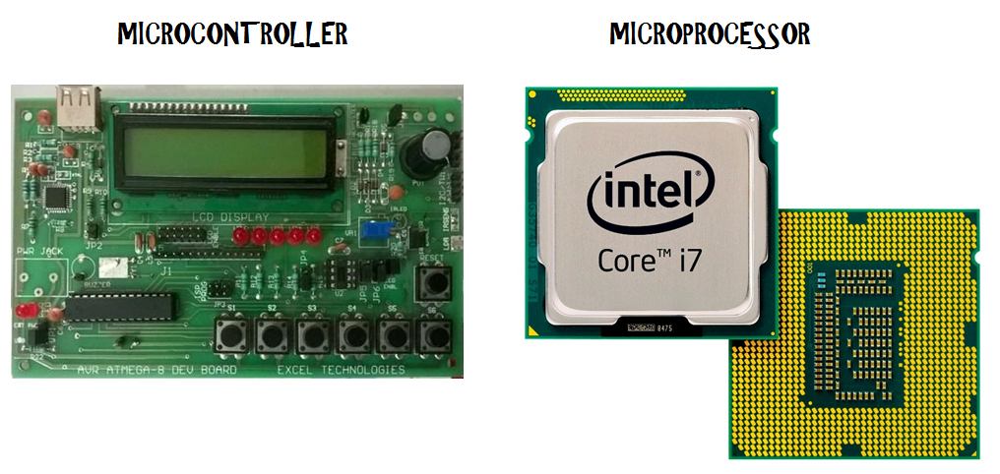

### **Microprocessor**

**Microprocessor** ເປັນ **ສະໝອງ** ຂອງລະບົບຄອມພິວເຕີ—ເປັນ **ໜ່ວຍປະມວນຜົນກາງ (CPU)** ຢູ່ໃນຊິບດຽວ.

### ຈຸດສຳຄັນ:

- ມັນປະມວນຜົນຂໍ້ມູນ (ປະຕິບັດການຄິດໄລ່, ຕາມເຫດຜົນ, ແລະການຕັດສິນໃຈ).

- ມັນ​ຮຽກ​ຮ້ອງ​ໃຫ້​ມີ​ອົງ​ປະ​ກອບ​ພາຍ​ນອກ (ເຊັ່ນ​: ຫນ່ວຍ​ຄວາມ​ຈໍາ​, input / output ports​, ແລະ timers​) ເພື່ອ​ເຮັດ​ວຽກ​.

- ມັນ​ຖືກ​ນໍາ​ໃຊ້​ໃນ **ຄອມ​ພິວ​ເຕີ​, laptops​, ແລະ​ລະ​ບົບ​ປະ​ສິດ​ທິ​ພາບ​ສູງ​.**

- ຕົວຢ່າງ:

    - Intel Core i5, i7

    - AMD Ryzen

    - Intel 8086, 8085

#### ຕົວຢ່າງ:

CPU ຂອງຄອມພິວເຕີເດັສທັອບແມ່ນໄມໂຄຣໂປຣເຊສເຊີຈັດການການຄຳນວນທັງໝົດ, ແຕ່ຕ້ອງການ RAM, ຮາດດິດ ແລະອຸປະກອນ I/O ເພື່ອເຮັດວຽກ.

---
### **Microcontroller**

**Microcontroller** ແມ່ນຄອມພິວເຕີຂະຫນາດນ້ອຍຢູ່ໃນຊິບດຽວ. ມັນປະກອບດ້ວຍ:

- CPU (ຫນ່ວຍ​ປະ​ມວນ​ຜົນ​)

- ຫນ່ວຍຄວາມຈໍາ (RAM + ROM)

- ພອດ I/O

- ເຄື່ອງຈັບເວລາ, ADCs, ແລະອື່ນໆ.

#### ຈຸດສຳຄັນ:

- ມັນເປັນອຸປະກອນທີ່ປະກອບດ້ວຍຕົນເອງ. ມັນມີທຸກສິ່ງທີ່ທ່ານຕ້ອງການຢູ່ໃນຊິບ.

- ມັນຖືກນໍາໃຊ້ສໍາລັບວຽກງານສະເພາະຫຼືລະບົບຝັງ.

- ຕົວຢ່າງ:

    - Arduino (ATmega328)

    - ESP32, ESP8266

    - PIC, STM32

