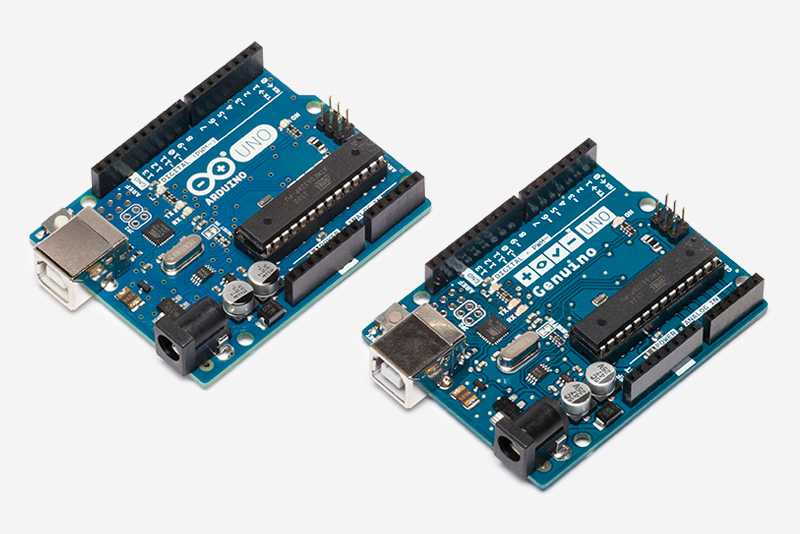
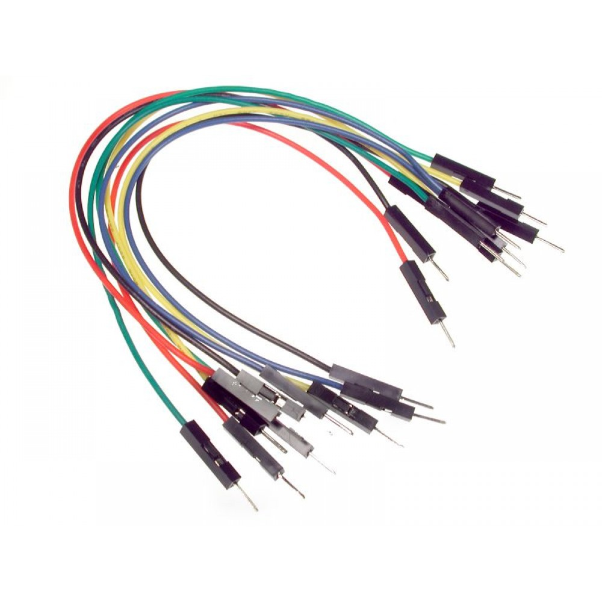

# ✅ Arduino Starter Kit Numbered Checklist

## ແຜ່ນວົງຈອນຫຼັກ ແລະ ການໂຕ້ຕອບ (Core Boards & Interfaces)

### **Arduino Uno Board**

- **ລາຍລະອຽດ**: Arduino Uno ແມ່ນແຜ່ນວົງຈອນໄມໂຄຣຄອນໂທນເລີຫຼັກ, ໂດຍອີງໃສ່ ATmega328P.
- **ໜ້າທີ່ການໃຊ້ງານ**: ເຮັດໜ້າທີ່ເປັນ "ສະໝອງ" ຂອງໂຄງການຂອງທ່ານ, ໄດ້ຮັບຄ່າປ້ອນເຂົ້າ ແລະ ຄວບຄຸມຄ່າອອກ (ເຊັນເຊີ, ມໍເຕີ, ໜ້າຈໍສະແດງຜົນ, ແລະ ອື່ນໆ).
- **ຕົວຢ່າງ**: ໃຊ້ໃນສະຖານີວັດແທກດິນຟ້າອາກາດ ເພື່ອເກັບກຳ ແລະ ສະແດງຂໍ້ມູນອຸນຫະພູມ ແລະ ຄວາມຊຸ່ມຊື່ນເທິງໜ້າຈໍ LCD.

ຮູບພາບອຸປະກອນ:

### **Breadboard**

- **ລາຍລະອຽດ**: ແຜ່ນວົງຈອນທົດລອງອະນຸຍາດໃຫ້ທ່ານສ້າງວົງຈອນໂດຍບໍ່ຕ້ອງບັດກີ, ໂດຍໃຊ້ຮູເພື່ອໃສ່ອົງປະກອບຕ່າງໆ.
- **ໜ້າທີ່ການໃຊ້ງານ**: ໃຊ້ເພື່ອສ້າງແບບຈຳລອງວົງຈອນງ່າຍໆ ເຊັ່ນ: ໄຟ LED ກະພິບ ຫຼື ການຕັ້ງຄ່າເຊັນເຊີ ກ່ອນທີ່ຈະສ້າງເປັນການອອກແບບສຸດທ້າຍ.
- **ຕົວຢ່າງ**: ໃຊ້ສຳລັບການສ້າງແບບຈຳລອງວົງຈອນເຊັນເຊີວັດແທກອຸນຫະພູມແບບງ່າຍໆ ກ່ອນທີ່ຈະໂອນຍ້າຍໄປໃສ່ແຜ່ນວົງຈອນ PCB ຖາວອນ.

ຮູບພາບອຸປະກອນ:

### **USB Cable**

- **ລາຍລະອຽດ**: ສາຍ USB A ຫາ B ເຊື່ອມຕໍ່ແຜ່ນວົງຈອນ Arduino ຂອງທ່ານກັບຄອມພິວເຕີ ເພື່ອອັບໂຫລດໂຄດ ແລະ ສະໜອງພະລັງງານໃຫ້ແກ່ແຜ່ນວົງຈອນ.
- **ໜ້າທີ່ການໃຊ້ງານ**: ສົ່ງຂໍ້ມູນລະຫວ່າງຄອມພິວເຕີຂອງທ່ານ ແລະ Arduino, ອະນຸຍາດໃຫ້ທ່ານອັບໂຫລດໂຄດ ແລະ ສະໜອງພະລັງງານໃຫ້ແກ່ແຜ່ນວົງຈອນ.
- **ຕົວຢ່າງ**: ໃຊ້ເພື່ອອັບໂຫລດໂປຣແກຣມ Arduino (ເຊັ່ນ: ການຄວບຄຸມມໍເຕີ Stepper) ຈາກຄອມພິວເຕີຂອງທ່ານໄປຍັງ Arduino.

ຮູບພາບອຸປະກອນ:

---

## ສາຍໄຟ ແລະ ຕົວເຊື່ອມຕໍ່ (Wiring & Connectors)

### **Jumper Wires (Male-to-Male)**

- **ລາຍລະອຽດ**: ສາຍໄຟທີ່ມີຫົວເຊື່ອມຕໍ່ແບບຜູ້ທັງສອງສົ້ນ.
- **ໜ້າທີ່ການໃຊ້ງານ**: ໃຊ້ເພື່ອເຊື່ອມຕໍ່ Arduino ເຂົ້າກັບແຜ່ນວົງຈອນທົດລອງ ຫຼື ອົງປະກອບອື່ນໆ ເຊັ່ນ: ເຊັນເຊີ ຫຼື ມໍເຕີ.
- **ຕົວຢ່າງ**: ໃຊ້ເພື່ອເຊື່ອມຕໍ່ເຊັນເຊີກວດຈັບການເຄື່ອນໄຫວ PIR ເຂົ້າກັບ Arduino ສໍາລັບລະບົບກວດຈັບການເຄື່ອນໄຫວ.

ຮູບພາບອຸປະກອນ:

### **Jumper Wires (Male-to-Female)**

- **ລາຍລະອຽດ**: ສາຍໄຟທີ່ມີຫົວເຊື່ອມຕໍ່ແບບຜູ້ຢູ່ສົ້ນໜຶ່ງ ແລະ ຫົວເຊື່ອມຕໍ່ແບບແມ່ຢູ່ສົ້ນອື່ນ.
- **ໜ້າທີ່ການໃຊ້ງານ**: ໃຊ້ເພື່ອເຊື່ອມຕໍ່ອົງປະກອບທີ່ມີຂາແບບແມ່ເຂົ້າກັບຂາຫົວຜູ້ຂອງ Arduino ຫຼື ເຂົ້າກັບເຊັນເຊີທີ່ມີຂາແບບຜູ້.
- **ຕົວຢ່າງ**: ໃຊ້ເພື່ອເຊື່ອມຕໍ່ໂມດູນເຊັນເຊີອຸນຫະພູມເຂົ້າກັບແຜ່ນວົງຈອນ Arduino Uno.

ຮູບພາບອຸປະກອນ:

### **Jumper Wires (Female-to-Female)**

- **ລາຍລະອຽດ**: ສາຍໄຟທີ່ມີຫົວເຊື່ອມຕໍ່ແບບແມ່ທັງສອງສົ້ນ.
- **ໜ້າທີ່ການໃຊ້ງານ**: ໃຊ້ເພື່ອເຊື່ອມຕໍ່ອົງປະກອບຫົວຜູ້ໃນແຜ່ນວົງຈອນທົດລອງເຂົ້າກັບຫົວເຊື່ອມຕໍ່ແບບຜູ້ເທິງ Arduino ຫຼື ໂມດູນອື່ນໆ.
- **ຕົວຢ່າງ**: ໃຊ້ເພື່ອເຊື່ອມຕໍ່ໂມດູນ RGB LED ເຂົ້າກັບແຜ່ນວົງຈອນທົດລອງ ແລະ Arduino.

ຮູບພາບອຸປະກອນ:

### **9V Battery Connector**

- **ລາຍລະອຽດ**: ຕົວເຊື່ອມຕໍ່ສຳລັບການຕິດແບັດເຕີຣີ 9V ເຂົ້າກັບແຜ່ນວົງຈອນ Arduino.
- **ໜ້າທີ່ການໃຊ້ງານ**: ສະໜອງແຫຼ່ງພະລັງງານທາງເລືອກສຳລັບໂຄງການ Arduino ເມື່ອບໍ່ໄດ້ເຊື່ອມຕໍ່ກັບຄອມພິວເຕີ.
- **ຕົວຢ່າງ**: ໃຊ້ໃນໂຄງການ Arduino ແບບພົກພາ ທີ່ບໍ່ມີພະລັງງານ USB ໃຫ້ໃຊ້, ເຊັ່ນ: ສະຖານີວັດແທກດິນຟ້າອາກາດແບບໄຮ້ສາຍ.

ຮູບພາບອຸປະກອນ:

---

## ອົງປະກອບພື້ນຖານ (Basic Components)

### **LEDs (Red, Yellow, Blue, RGB)**

- **ລາຍລະອຽດ**: ໄດໂອດປ່ອຍແສງ (LEDs) ໃນສີຕ່າງໆ, ລວມທັງໂມດູນ RGB LED ທີ່ໃຊ້ທົ່ວໄປ.
- **ໜ້າທີ່ການໃຊ້ງານ**: ໃຊ້ສຳລັບສັນຍານຜົນອອກແບບງ່າຍໆໃນໂຄງການ, ເຊັ່ນ: ການສະແດງໄຟສະຖານະ ຫຼື ຕົວຊີ້ບອກທາງສາຍຕາ.
- **ຕົວຢ່າງ**: ໃຊ້ເພື່ອສະແດງສະຖານະຂອງອຸປະກອນ IoT, ເຊັ່ນ: ສະແດງເວລາທີ່ລະບົບຖືກເປີດ (ໄຟ LED ສີຂຽວ), ກຳລັງໃຊ້ງານ (ໄຟ LED ສີເຫຼືອງ), ຫຼື ເກີດຂໍ້ຜິດພາດ (ໄຟ LED ສີແດງ).

ຮູບພາບອຸປະກອນ:
.jpeg>)

### **RGB Module**

- **ລາຍລະອຽດ**: ໂມດູນທີ່ມີໄຟ LED ສີແດງ, ສີຂຽວ, ແລະ ສີຟ້າ ເພື່ອຜະລິດສີຕ່າງໆ.
- **ໜ້າທີ່ການໃຊ້ງານ**: ອະນຸຍາດໃຫ້ທ່ານຜະລິດສີທີ່ແຕກຕ່າງກັນ ໂດຍການປັບຄວາມສະຫວ່າງຂອງອົງປະກອບສີແຕ່ລະອັນ.
- **ຕົວຢ່າງ**: ໃຊ້ເພື່ອສ້າງໄຟປ່ຽນສີໃນໂຄງການໄຟອັດສະລິຍະ, ເຊັ່ນ: ສໍາລັບການໃຫ້ແສງສະຫວ່າງຕາມບັນຍາກາດ ຫຼື ການຄວບຄຸມແສງສະຫວ່າງໃນຫ້ອງ.

ຮູບພາບອຸປະກອນ:

### **Resistors (220Ω, 1kΩ, 10kΩ)**

- **ລາຍລະອຽດ**: ຕົວຕ້ານທານຈຳກັດກະແສໄຟຟ້າທີ່ໄຫລຜ່ານອົງປະກອບຕ່າງໆ.
- **ໜ້າທີ່ການໃຊ້ງານ**: ປົກປ້ອງໄຟ LED ແລະ ອົງປະກອບອື່ນໆ ໂດຍການຫຼຸດຜ່ອນກະແສໄຟຟ້າທີ່ໄຫລຜ່ານພວກມັນ.
- **ຕົວຢ່າງ**: ໃຊ້ເພື່ອຈຳກັດກະແສໄຟຟ້າໄປຍັງໄຟ LED ໃນວົງຈອນໄຟກະພິບ ເພື່ອປ້ອງກັນບໍ່ໃຫ້ມັນໄໝ້.

ຮູບພາບອຸປະກອນ:
.jpg>)

### **Push Buttons (x4 with Lids)**

- **ລາຍລະອຽດ**: ຊຸດປຸ່ມຕ່າງໆທີ່ສາມາດກົດເພື່ອສົ່ງສັນຍານປ້ອນເຂົ້າໄດ້.
- **ໜ້າທີ່ການໃຊ້ງານ**: ໃຊ້ໃນການໂຕ້ຕອບກັບຜູ້ໃຊ້, ເຊັ່ນ: ການເປີດ/ປິດສິ່ງໃດສິ່ງໜຶ່ງ ຫຼື ການສົ່ງສັນຍານ.
- **ຕົວຢ່າງ**: ໃຊ້ໃນລະບົບຮັກສາຄວາມປອດໄພແບບງ່າຍໆ ທີ່ການກົດປຸ່ມສາມາດກະຕຸ້ນສຽງເຕືອນ ຫຼື ປິດລະບົບ.

ຮູບພາບອຸປະກອນ:
.jpg>)

### **Potentiometer (5kΩ)**

- **ລາຍລະອຽດ**: ຕົວຕ້ານທານທີ່ສາມາດປັບຄ່າຄວາມຕ້ານທານດ້ວຍມືໄດ້.
- **ໜ້າທີ່ການໃຊ້ງານ**: ໃຊ້ເພື່ອຄວບຄຸມຄວາມສະຫວ່າງຂອງໄຟ LED, ການຄວບຄຸມລະດັບສຽງ, ຫຼື ລັກສະນະທີ່ສາມາດປັບໄດ້ອື່ນໆໃນໂຄງການ.
- **ຕົວຢ່າງ**: ໃຊ້ເປັນປຸ່ມໝູນປັບລະດັບສຽງໃນເຄື່ອງຫຼິ້ນສຽງ ຫຼື ເປັນຕົວປັບຄວາມສະຫວ່າງສຳລັບລະບົບແສງສະຫວ່າງ.

ຮູບພາບອຸປະກອນ:
.jpeg)

### **Active Buzzer**

- **ລາຍລະອຽດ**: Buzzer ທີ່ປ່ອຍສຽງເມື່ອໄດ້ຮັບພະລັງງານ.
- **ໜ້າທີ່ການໃຊ້ງານ**: ປ່ອຍສຽງຢ່າງຕໍ່ເນື່ອງ, ໃຊ້ສຳລັບການແຈ້ງເຕືອນ ຫຼື ສັນຍານເຫດການໃນໂຄງການ.
- **ຕົວຢ່າງ**: ໃຊ້ເພື່ອສົ່ງສຽງເຕືອນເມື່ອເຊັນເຊີກວດຈັບການເຄື່ອນໄຫວຖືກກະຕຸ້ນໃນລະບົບຮັກສາຄວາມປອດໄພໃນເຮືອນ.

ຮູບພາບອຸປະກອນ:

### **Passive Buzzer**

- **ລາຍລະອຽດ**: Buzzer ທີ່ຜະລິດສຽງເມື່ອມັນໄດ້ຮັບສັນຍານຄື້ນສີ່ຫຼ່ຽມເທົ່ານັ້ນ.
- **ໜ້າທີ່ການໃຊ້ງານ**: ໃຊ້ສຳລັບການຜະລິດສຽງ ຫຼື ສຽງບີບແບບງ່າຍໆ ໂດຍອີງໃສ່ສັນຍານທີ່ຖືກສົ່ງໄປຫາ.
- **ຕົວຢ່າງ**: ໃຊ້ໃນໂຄງການຈັບເວລາ ເພື່ອສົ່ງສຽງບີບຫາຜູ້ໃຊ້ເມື່ອໝົດເວລາ.

ຮູບພາບອຸປະກອນ:

---

## ໜ້າຈໍສະແດງຜົນ ແລະ ຜົນອອກ (Displays & Output)

### **16x2 LCD Display**

- **ລາຍລະອຽດ**: ໜ້າຈໍ LCD 16 ຕົວອັກສອນ ໂດຍ 2 ແຖວ.
- **ໜ້າທີ່ການໃຊ້ງານ**: ສະແດງຂໍ້ຄວາມ ຫຼື ຕົວເລກສຳລັບຜົນອອກຂອງຜູ້ໃຊ້ໃນໂຄງການຕ່າງໆ (ເຊັ່ນ: ການອ່ານຄ່າຈາກເຊັນເຊີ).
- **ຕົວຢ່າງ**: ໃຊ້ເພື່ອສະແດງຄ່າອຸນຫະພູມທີ່ອ່ານໄດ້ຈາກເຊັນເຊີ DHT11 ໃນລະບົບຕິດຕາມສະພາບອາກາດ.

ຮູບພາບອຸປະກອນ:

### **I2C Serial Adapter Board Module**

- **ລາຍລະອຽດ**: ອະນຸຍາດໃຫ້ເຊື່ອມຕໍ່ອຸປະກອນ I2C ງ່າຍຂຶ້ນ ເຊັ່ນ: LCD ເຂົ້າກັບ Arduino.
- **ໜ້າທີ່ການໃຊ້ງານ**: ຫຼຸດຜ່ອນຈໍານວນຂາທີ່ໃຊ້ ແລະ ເຮັດໃຫ້ການສື່ສານລະຫວ່າງ Arduino ແລະ ໜ້າຈໍສະແດງຜົນງ່າຍຂຶ້ນ.
- **ຕົວຢ່າງ**: ໃຊ້ກັບ LCD ເພື່ອປະຢັດຂາ ແລະ ອະນຸຍາດໃຫ້ສື່ສານງ່າຍຂຶ້ນສຳລັບການສະແດງຂໍ້ມູນໃນໂຄງການ.

ຮູບພາບອຸປະກອນ:

### **7-Segment Display (Common Cathode +)**

- **ລາຍລະອຽດ**: ໜ້າຈໍ 7-segment ໃຊ້ສຳລັບການສະແດງຕົວເລກ.
- **ໜ້າທີ່ການໃຊ້ງານ**: ສະແດງຕົວເລກໃນໂຄງການຂອງທ່ານ, ທີ່ໃຊ້ທົ່ວໄປໃນໂມງ, ເຄື່ອງຈັບເວລາ, ຫຼື ເຄື່ອງນັບ.
- **ຕົວຢ່າງ**: ໃຊ້ໃນໂມງດິຈິຕອລແບບງ່າຍໆ ເພື່ອສະແດງເວລາໃນຮູບແບບ 24 ຊົ່ວໂມງ.

ຮູບພາບອຸປະກອນ:
.jpeg>)

### **4-Digit 7-Segment Display**

- **ລາຍລະອຽດ**: ໜ້າຈໍທີ່ສະແດງສີ່ຕົວເລກ ໂດຍໃຊ້ໜ້າຈໍ 7-segment.
- **ໜ້າທີ່ການໃຊ້ງານ**: ໃຊ້ເພື່ອສະແດງຂໍ້ມູນຕົວເລກຫຼາຍຕົວ, ເຊັ່ນ: ເວລາ ຫຼື ຄ່າຈາກເຊັນເຊີ.
- **ຕົວຢ່າງ**: ໃຊ້ໃນໂຄງການນັບຖອຍຫຼັງ ເພື່ອສະແດງເວລາທີ່ຍັງເຫຼືອ.

ຮູບພາບອຸປະກອນ:

### **8x8 Dot Matrix Display**

- **ລາຍລະອຽດ**: ຕາຂ່າຍຂອງໄຟ LED ທີ່ຈັດລຽງຢູ່ໃນຮູບແບບ matrix 8x8.
- **ໜ້າທີ່ການໃຊ້ງານ**: ສະແດງຕົວອັກສອນ ແລະ ຕົວເລກ, ຮູບພາບ, ຫຼື ອານິເມຊັນ, ມັກໃຊ້ສຳລັບຜົນອອກທາງສາຍຕາທີ່ສັບສົນກວ່າ.
- **ຕົວຢ່າງ**: ໃຊ້ເພື່ອສະແດງຂໍ້ຄວາມເລື່ອນ ຫຼື ອານິເມຊັນ, ເຊັ່ນ: ການສະແດງຂໍ້ຄວາມ ຫຼື ຮູບພາບທີ່ກຳນົດເອງ.

ຮູບພາບອຸປະກອນ:

---

## ເຊັນເຊີ ແລະ ໂມດູນປ້ອນເຂົ້າ (Sensors & Input Modules)

### **Temperature and Humidity Sensor (DHT11)**

- **ລາຍລະອຽດ**: ເຊັນເຊີທີ່ວັດແທກທັງອຸນຫະພູມ ແລະ ຄວາມຊຸ່ມຊື່ນ.
- **ໜ້າທີ່ການໃຊ້ງານ**: ໃຊ້ສຳລັບການຕິດຕາມສະພາບແວດລ້ອມ, ເຊັ່ນ: ການກວດຈັບການປ່ຽນແປງຂອງອຸນຫະພູມ ຫຼື ຄຸນນະພາບອາກາດ.
- **ຕົວຢ່າງ**: ໃຊ້ໃນລະບົບອັດຕະໂນມັດໃນເຮືອນ ເພື່ອຄວບຄຸມພັດລົມໂດຍອີງໃສ່ອຸນຫະພູມຫ້ອງ ແລະ ລະດັບຄວາມຊຸ່ມຊື່ນ.

ຮູບພາບອຸປະກອນ:
.jpeg>)

### **LM35 Temperature Sensor**

- **ລາຍລະອຽດ**: ເຊັນເຊີທີ່ວັດແທກອຸນຫະພູມເປັນອົງສາເຊນຊຽສ.
- **ໜ້າທີ່ການໃຊ້ງານ**: ໃຫ້ການອ່ານອຸນຫະພູມທີ່ຊັດເຈນສຳລັບການນຳໃຊ້ຕ່າງໆ, ເຊັ່ນ: ສະຖານີວັດແທກດິນຟ້າອາກາດ.
- **ຕົວຢ່າງ**: ໃຊ້ໃນລະບົບຕິດຕາມພືດ ເພື່ອວັດແທກອຸນຫະພູມຂອງດິນ ແລະ ຄວບຄຸມການຊົນລະປະທານ.

ຮູບພາບອຸປະກອນ:

### **Tilt Sensor (x2)**

- **ລາຍລະອຽດ**: ເຊັນເຊີທີ່ກວດຈັບການປ່ຽນແປງໃນທິດທາງ.
- **ໜ້າທີ່ການໃຊ້ງານ**: ມັກໃຊ້ໃນໂຄງການທີ່ກວດຈັບການເຄື່ອນໄຫວ ຫຼື ການອຽງ, ເຊັ່ນ: ສັນຍານເຕືອນການເຄື່ອນໄຫວ.
- **ຕົວຢ່າງ**: ໃຊ້ໃນລະບົບເປີດປະຕູອັດຕະໂນມັດ ທີ່ເປີດເມື່ອເຊັນເຊີກວດຈັບການອຽງກວດພົບຄົນຍ່າງເຂົ້າໃກ້.

ຮູບພາບອຸປະກອນ:
.jpeg>)

### **Photoresistor (LDRs x3)**

- **ລາຍລະອຽດ**: ຕົວຕ້ານທານທີ່ຂຶ້ນກັບແສງ ທີ່ປ່ຽນແປງຄ່າຄວາມຕ້ານທານໂດຍອີງໃສ່ການສໍາຜັດກັບແສງ.
- **ໜ້າທີ່ການໃຊ້ງານ**: ໃຊ້ສຳລັບການກວດຈັບລະດັບແສງໃນຫ້ອງ ຫຼື ສໍາລັບການນຳໃຊ້ເຊັ່ນ: ວົງຈອນທີ່ໄວຕໍ່ແສງ.
- **ຕົວຢ່າງ**: ໃຊ້ໃນລະບົບໄຟອັດຕະໂນມັດ ທີ່ເປີດ ຫຼື ປິດໄຟໂດຍອີງໃສ່ລະດັບແສງອ້ອມຂ້າງ.

ຮູບພາບອຸປະກອນ:
.jpeg>)

### **PIR Sensor**

- **ລາຍລະອຽດ**: ເຊັນເຊີ Passive Infrared ສໍາລັບການກວດຈັບການເຄື່ອນໄຫວ.
- **ໜ້າທີ່ການໃຊ້ງານ**: ໃຊ້ໃນລະບົບກວດຈັບການເຄື່ອນໄຫວ, ເຊັ່ນ: ສັນຍານເຕືອນໄພຄວາມປອດໄພ.
- **ຕົວຢ່າງ**: ໃຊ້ໃນລະບົບຮັກສາຄວາມປອດໄພ ເພື່ອກະຕຸ້ນສັນຍານເຕືອນ ຫຼື ໄຟ ເມື່ອກວດພົບການເຄື່ອນໄຫວ.

ຮູບພາບອຸປະກອນ:

### **Ultrasonic Module**

- **ລາຍລະອຽດ**: ເຊັນເຊີສຳລັບການວັດແທກໄລຍະທາງໂດຍໃຊ້ຄື້ນສຽງ.
- **ໜ້າທີ່ການໃຊ້ງານ**: ໃຊ້ທົ່ວໄປໃນຫຸ່ນຍົນສໍາລັບການກວດຈັບອຸປະສັກ ຫຼື ການນໍາໃຊ້ການວັດແທກໄລຍະທາງ.
- **ຕົວຢ່າງ**: ໃຊ້ໃນຫຸ່ນຍົນເພື່ອຫຼີກລ້ຽງອຸປະສັກ ໂດຍການວັດແທກໄລຍະທາງໄປຫາວັດຖຸໃນເສັ້ນທາງຂອງມັນ.

ຮູບພາບອຸປະກອນ:

### **Sound Sensor**

- **ລາຍລະອຽດ**: ເຊັນເຊີທີ່ກວດຈັບສຽງ ຫຼື ການສັ່ນສະເທືອນ.
- **ໜ້າທີ່ການໃຊ້ງານ**: ມັກໃຊ້ໃນໂຄງການເພື່ອຄົ້ນຫາລະດັບສຽງ ຫຼື ເປີດໃຊ້ອຸປະກອນໂດຍອີງໃສ່ສຽງ.
- **ຕົວຢ່າງ**: ໃຊ້ໃນການສະແດງແສງທີ່ກະຕຸ້ນດ້ວຍສຽງ ທີ່ປ່ຽນໄຟໂດຍອີງໃສ່ສຽງເພງ ຫຼື ລະດັບສຽງ.

ຮູບພາບອຸປະກອນ:

### **Water Sensor**

- **ລາຍລະອຽດ**: ເຊັນເຊີທີ່ກວດຈັບການມີຢູ່ຂອງນ້ຳ ຫຼື ຄວາມຊຸ່ມຊື່ນ.
- **ໜ້າທີ່ການໃຊ້ງານ**: ໃຊ້ໃນການນຳໃຊ້ ເຊັ່ນ: ການກວດຈັບການຮົ່ວໄຫຼຂອງນ້ຳ ຫຼື ການຕິດຕາມຄວາມຊຸ່ມຊື່ນຂອງດິນ.
- **ຕົວຢ່າງ**: ໃຊ້ໃນລະບົບການຫົດນ້ຳສວນ ເພື່ອກວດຈັບຄວາມຊຸ່ມຊື່ນຂອງດິນ ແລະ ເປີດໃຊ້ການຫົດນ້ຳເມື່ອຈຳເປັນ.

ຮູບພາບອຸປະກອນ:

### **Flame Sensor**

- **ລາຍລະອຽດ**: ເຊັນເຊີທີ່ອອກແບບມາເພື່ອກວດຈັບແປວໄຟ ຫຼື ໄຟ.
- **ໜ້າທີ່ການໃຊ້ງານ**: ໃຊ້ໃນລະບົບກວດຈັບໄຟ ເພື່ອແຈ້ງເຕືອນເມື່ອກວດພົບແປວໄຟ.
- **ຕົວຢ່າງ**: ໃຊ້ໃນລະບົບສັນຍານເຕືອນໄຟ ເພື່ອກະຕຸ້ນການແຈ້ງເຕືອນເມື່ອກວດພົບໄຟ.

ຮູບພາບອຸປະກອນ:

### **RFID Module**

- **ລາຍລະອຽດ**: ໂມດູນ Radio Frequency Identification ໃຊ້ສຳລັບການອ່ານແທັກ RFID.
- **ໜ້າທີ່ການໃຊ້ງານ**: ໃຊ້ສຳລັບລະບົບການກໍານົດຕົວຕົນ, ເຊັ່ນ: ລະບົບຄວາມປອດໄພ ຫຼື ການຕິດຕາມການເຂົ້າຮ່ວມ.
- **ຕົວຢ່າງ**: ໃຊ້ໃນລະບົບຄວບຄຸມການເຂົ້າເຖິງ ເພື່ອອະນຸຍາດໃຫ້ເຂົ້າໄດ້ເມື່ອກວດພົບແທັກ RFID.

ຮູບພາບອຸປະກອນ:

### **RFID Tag**

- **ລາຍລະອຽດ**: ແທັກຂະໜາດນ້ອຍທີ່ມີຊິບ RFID ສໍາລັບຈຸດປະສົງການກໍານົດຕົວຕົນ.
- **ໜ້າທີ່ການໃຊ້ງານ**: ເຮັດວຽກຮ່ວມກັບໂມດູນ RFID ເພື່ອສະໜອງການກໍານົດຕົວຕົນທີ່ເປັນເອກະລັກສໍາລັບຄົນ ຫຼື ວັດຖຸ.
- **ຕົວຢ່າງ**: ໃຊ້ເປັນບັດປະຈຳຕົວສຳລັບລະບົບຮັກສາຄວາມປອດໄພ, ອະນຸຍາດໃຫ້ບຸກຄະລາກອນທີ່ໄດ້ຮັບອະນຸຍາດເຂົ້າໂດຍການສະແກນແທັກ RFID.

ຮູບພາບອຸປະກອນ:

---

## ຣີໂມດ ແລະ ການຄວບຄຸມ (Remote & Control)

### **Infrared Remote Control**

- **ລາຍລະອຽດ**: ຣີໂມດທີ່ສົ່ງສັນຍານ infrared ເພື່ອຄວບຄຸມອຸປະກອນ.
- **ໜ້າທີ່ການໃຊ້ງານ**: ໃຊ້ເພື່ອຄວບຄຸມອຸປະກອນແບບໄຮ້ສາຍ, ເຊັ່ນ: ການເປີດ/ປິດໄຟ LED ຫຼື ມໍເຕີຈາກໄລຍະໄກ.
- **ຕົວຢ່າງ**: ໃຊ້ໃນລະບົບໂຮມເທຍເຕີ ເພື່ອຄວບຄຸມໂທລະທັດ ຫຼື ລະບົບສຽງຈາກໄລຍະໄກ.

ຮູບພາບອຸປະກອນ:

### **Joystick Module**

- **ລາຍລະອຽດ**: Joystick 2 ແກນ ສຳລັບການປ້ອນເຂົ້າ.
- **ໜ້າທີ່ການໃຊ້ງານ**: ອະນຸຍາດໃຫ້ຄວບຄຸມທິດທາງໃນໂຄງການ, ໃຊ້ທົ່ວໄປໃນຫຸ່ນຍົນ ຫຼື ເກມ.
- **ຕົວຢ່າງ**: ໃຊ້ໃນຫຸ່ນຍົນເພື່ອຄວບຄຸມການເຄື່ອນໄຫວໂດຍອີງໃສ່ການປ້ອນເຂົ້າຈາກ joystick.

ຮູບພາບອຸປະກອນ:

### **4x4 Matrix Keyboard Module**

- **ລາຍລະອຽດ**: ແປ້ນພິມທີ່ມີ 4 ແຖວ ແລະ 4 ຖັນຂອງປຸ່ມ.
- **ໜ້າທີ່ການໃຊ້ງານ**: ໃຊ້ສຳລັບການປ້ອນເຂົ້າຂອງຜູ້ໃຊ້ໃນໂຄງການທີ່ຕ້ອງການປຸ່ມຕົວເລກ ຫຼື ລະບົບລະຫັດຜ່ານ.
- **ຕົວຢ່າງ**: ໃຊ້ໃນລະບົບຮັກສາຄວາມປອດໄພ ເພື່ອປ້ອນລະຫັດຜ່ານ ແລະ ປົດລັອກປະຕູ.

ຮູບພາບອຸປະກອນ:

### **Relay Module**

- **ລາຍລະອຽດ**: ໂມດູນ relay ທີ່ໃຊ້ສຳລັບການຄວບຄຸມອຸປະກອນແຮງດັນສູງດ້ວຍ Arduino.
- **ໜ້າທີ່ການໃຊ້ງານ**: ເຮັດໜ້າທີ່ເປັນສະວິດອີເລັກໂທຣນິກສຳລັບການຄວບຄຸມອຸປະກອນພະລັງງານສູງ, ເຊັ່ນ: ມໍເຕີ ຫຼື ໂຄມໄຟ.
- **ຕົວຢ່າງ**: ໃຊ້ໃນລະບົບໄຟອັດຕະໂນມັດໃນເຮືອນ ເພື່ອຄວບຄຸມໄຟໂດຍອີງໃສ່ເວລາຂອງມື້ ຫຼື ການກວດຈັບການເຄື່ອນໄຫວ.

ຮູບພາບອຸປະກອນ:

---

## ມໍເຕີ ແລະ ຕົວຂັບ (Motors & Drivers)

### **Servo Motor**

- **ລາຍລະອຽດ**: ມໍເຕີທີ່ມີການຄວບຄຸມທີ່ຊັດເຈນກ່ຽວກັບມຸມໝູນຂອງມັນ.
- **ໜ້າທີ່ການໃຊ້ງານ**: ໃຊ້ສຳລັບການຄວບຄຸມການເຄື່ອນໄຫວທີ່ຊັດເຈນໃນໂຄງການຫຸ່ນຍົນ ຫຼື ກົນຈັກ.
- **ຕົວຢ່າງ**: ໃຊ້ໃນແຂນຫຸ່ນຍົນ ເພື່ອຄວບຄຸມການເຄື່ອນໄຫວຂອງມັນໃນວຽກງານການຜະລິດ ຫຼື ການປະກອບ.

ຮູບພາບອຸປະກອນ:

### **Stepper Motor**

- **ລາຍລະອຽດ**: ມໍເຕີທີ່ເຄື່ອນທີ່ເປັນຂັ້ນຕອນທີ່ບໍ່ຕໍ່ເນື່ອງ.
- **ໜ້າທີ່ການໃຊ້ງານ**: ໃຫ້ການຄວບຄຸມການເຄື່ອນໄຫວທີ່ຊັດເຈນ, ໃຊ້ທົ່ວໄປໃນເຄື່ອງຈັກ CNC ຫຼື ເຄື່ອງພິມ 3D.
- **ຕົວຢ່າງ**: ໃຊ້ໃນເຄື່ອງພິມ 3D ເພື່ອຍ້າຍຫົວພິມດ້ວຍຄວາມຖືກຕ້ອງສູງ.

ຮູບພາບອຸປະກອນ:

### **Stepper Motor Driver Board**

- **ລາຍລະອຽດ**: ແຜ່ນຂັບທີ່ໃຊ້ເພື່ອຄວບຄຸມມໍເຕີ Stepper.
- **ໜ້າທີ່ການໃຊ້ງານ**: ຄວບຄຸມພະລັງງານທີ່ສົ່ງໄປຫາ ມໍເຕີ Stepper ເພື່ອຄວບຄຸມການເຄື່ອນໄຫວຂອງມັນ.
- **ຕົວຢ່າງ**: ໃຊ້ເພື່ອຄວບຄຸມມໍເຕີ Stepper ໃນເຄື່ອງຈັກ CNC ຫຼື ເຄື່ອງພິມ 3D.

ຮູບພາບອຸປະກອນ:

---

## ICs ແລະ ໂມດູນ (ICs & Modules)

### **Real-time Clock Module DS1302**

- **ລາຍລະອຽດ**: ໂມດູນທີ່ຕິດຕາມເວລາ ແລະ ວັນທີ.
- **ໜ້າທີ່ການໃຊ້ງານ**: ໃຊ້ໃນໂຄງການທີ່ຕ້ອງການການຮັກສາເວລາ, ເຊັ່ນ: ໂມງ, ເຄື່ອງຈັບເວລາ, ຫຼື ລະບົບການບັນທຶກເຫດການ.
- **ຕົວຢ່າງ**: ໃຊ້ໃນລະບົບການຕິດຕາມເວລາສຳລັບໂຄງການ ຫຼື ຕາຕະລາງເຫດການ.

ຮູບພາບອຸປະກອນ:

### **74HC595 Chip**

- **ລາຍລະອຽດ**: Shift register ທີ່ໃຊ້ເພື່ອຄວບຄຸມຜົນອອກຫຼາຍອັນດ້ວຍຈຳນວນຂານ້ອຍລົງ.
- **ໜ້າທີ່ການໃຊ້ງານ**: ຂະຫຍາຍຈຳນວນຂາຜົນອອກທີ່ມີຢູ່ໃນ Arduino, ໃຊ້ທົ່ວໄປສຳລັບການຄວບຄຸມໄຟ LED ຫຼື ໜ້າຈໍສະແດງຜົນ.
- **ຕົວຢ່າງ**: ໃຊ້ໃນໂຄງການເພື່ອຄວບຄຸມ matrix ຂອງໄຟ LED ຂະໜາດໃຫຍ່ສຳລັບຜົນກະທົບທາງສາຍຕາ ຫຼື ໜ້າຈໍສະແດງຜົນ.

ຮູບພາບອຸປະກອນ:

